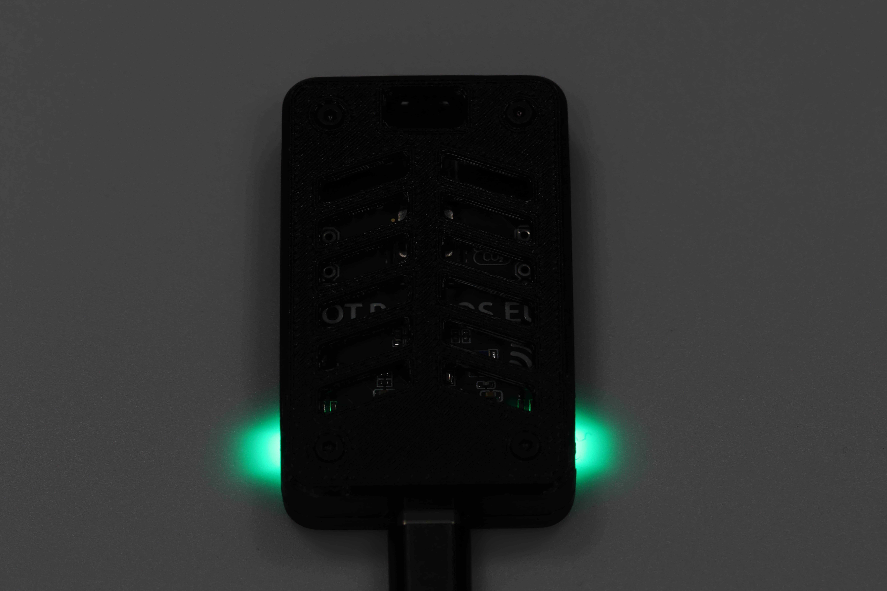

# Room monitoring device

## Used parts

- ESP32 - microcontroller
- SHT40 - temperature and humidity
- BH1750 - light
- SCD40 - CO2, temperature and humidity

## Schematic

## Manufacturing

**⚠️ Warning: Do not manufacture my PCB design. Step-down and ESP is heating the board resulting with wrong temperature measurement. It needs to be redesigned!**

If you still want to manufacture it. Just upload content of `pcb` folder to your favorite PCB manufacturer. I used [JLCPCB](https://jlcpcb.com/).

## Programming

1. Install [PlatformIO](https://platformio.org/) extension for your favorite IDE.
2. Clone this repository.
3. Open this project in your IDE.
4. Rename `src/secret.example.h` to `src/secret.h`
5. Fill in wifi and mqtt credentials and sensor id.
6. Connect board to your computer.
7. Build and upload project to your board.
8. Done. LEDs should light up.

Sensor sends data over MQTT. You can use my other [project](https://github.com/LosBagros/iot-platform).

## Case

Case was designed by [Jakub Lips](https://www.instagram.com/__li_po_/)

## Images

## SVG Sources

- https://www.svgrepo.com/svg/473423/temperature-half - MIT
- https://www.svgrepo.com/svg/236180/co2 - CC0
- https://www.svgrepo.com/svg/479509/light-bulb - Public Domain
- https://www.svgrepo.com/svg/162992/mall-wifi-sign - CC0
- https://www.svgrepo.com/svg/64380/diagonal-arrow - CC0

[Tabler icons](https://tabler.io/icons/)

- microwave-off
- bucket-droplet
- flame
- bolt
- gavel
- paw-off

## License

[WTFPL](./LICENSE)

Libraries used in this project are licensed under their respective licenses.
